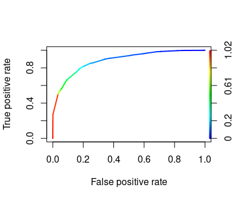

#  Association Rule Classification (arc)

[](http://cran.rstudio.com/web/packages/qCBA/index.html)
[](https://cran.r-project.org/web/packages/arc/index.html)


This package for R implements the Classification based on Associations algorithm (CBA):

 ```Liu, B. Hsu, W. and Ma, Y (1998). Integrating Classification and Association Rule Mining. Proceedings KDD-98, New York, 27-31 August. AAAI. pp 80-86.```

The [arules](https://github.com/mhahsler/arules/) package is used for the rule generation step.

The package is also availabe in **R CRAN repository** as [Association Rule Classification (arc)](https://cran.r-project.org/web/packages/arc/index.html) package.
## Features 
- Pure R implementation* 
- Supports numerical predictor attributes (via parameter-free supervised  discretization)
- Supports numerical target attribute (k-means)
- No meta parameters with automatic tuning of support and confidence thresholds (optional)**

NOTES: * Requires the arules package for the rule generation step ** There are some metaparameters for automatic tuning, but in most cases the default values are OK.

## Other use cases
- `prune` function can be used to reduce the size of a rule set learnt by the apriori function from the  arules package
- `topRules` function can be used as a wrapper for apriori allowing to mine for a user specified number of rules.

## Installation
The package can be installed directly from CRAN using the following command executed from the R environment:
```R
install.packages("arc")
```
Development version can be installed from github from the R environment using the devtools package.
```R
devtools::install_github("kliegr/arc")
```

## Examples

### Complete classification workflow
```R
data(iris) # note that the iris dataset contains numerical features
library(arc)
set.seed(101)
iris_shuffleed <- datasets::iris[sample(nrow(datasets::iris)),]
trainFold <- iris_shuffleed[1:100,]
testFold <- iris_shuffleed[101:nrow(iris_shuffleed),]
classatt <- "Species"
# learn the classifier
rm <- cba(train, classatt)
prediction <- predict(rm, test)
acc <- CBARuleModelAccuracy(prediction, test[[classatt]])
print(acc)
```

### Prune rules
This shows how to apply arc data coverage pruning to reduce the size of the rule set. A prerequisite is a rule learning task with one attribute on the right hand side.
```R
library(arc)
data(Adult)
classitems <- c("income=small","income=large")
rules <- apriori(Adult, parameter = list(supp = 0.05, conf = 0.5, target = "rules"), appearance=list(rhs=classitems, default="lhs"))
# now we have 1266 rules
pr_rules <- prune(rules,Adult,classitems)
# only 174 after pruning
```

Additional reduction of the size of the rule set can be achieved by setting `greedy_pruning=TRUE`.
```R
pr_rules <- prune(rules, Adult, classitems, greedy_pruning=TRUE)
# produces 141 rules
```
Pruning by default consists of two steps, data coverage pruning and default rule pruning, which replaces part of the rules surviving data coverage pruning with a new default rule (rule with empty LHS). Default rule pruning can be turned off:
```R
pr_rules <- prune(rules, Adult, classitems, default_rule_pruning = FALSE)
# produces 199 rules
```


### Mine predefined number of rules with apriori
The [arules documentation](https://cran.r-project.org/web/packages/arules/arules.pdf) gives the following example:
```R
data("Adult")
## Mine association rules.
rules <- apriori(Adult, parameter = list(supp = 0.5, conf = 0.9, target = "rules"))
summary(rules)
```
This returns 52 rules. The default value for the minlen and maxlen parameters unspecified by the user was 1 and 10. 
Assuming that the user wishes to obtain 100 rules, this can be achieved with the arc package as follows:

```R
data("Adult")
rules <- topRules(Adult, target_rule_count = 100, init_support = 0.5, init_conf = 0.9, minlen = 1, init_maxlen = 10)
summary(rules)
```
This will return 100 rules. The mechanics behind are  iterative step-wise changes to the initial values of the provided thresholds. In this case, there will be nine iterations, the minimum confidence threshold will be lowered to 0.65 and the final rule set will be trimmed.


## New: Explaining predictions
``` R
set.seed(101)
irisShuffled <- datasets::iris[sample(nrow(datasets::iris)),]
trainFold <- irisShuffled[1:100,]
testFold <- irisShuffled[101:nrow(irisShuffled),]
#increase for more accurate results in longer time
target_rule_count <- 1000
classAtt <- "Species"
rm <- cba(trainFold, classAtt, list(target_rule_count = target_rule_count))
prediction <- predict(rm, testFold)
```

Now consider this instance:
``` R
testFold[28,]
```

```
   Sepal.Length Sepal.Width Petal.Length Petal.Width    Species
51            7         3.2          4.7         1.4 versicolor
``` 
The prediction is
``` R
prediction[28]
```
```
[1] versicolor
Levels: setosa versicolor virginica
```
But why, and what is the confidence?

### Get rule that made the prediction
Which rule classified instance #28 in test?
``` R
firingRuleIDs <- predict(rm, testFold, outputFiringRuleIDs=TRUE) 
inspect(rm@rules[firingRuleIDs[28]])
```
The firing rule is
```
lhs                                                  rhs                  support confidence coverage lift     count
[1] {Petal.Length=(2.45;4.95],Petal.Width=(0.8;1.75]} => {Species=versicolor} 0.36    0.972973   0.37     2.494802 36   
    lhs_length orderedConf orderedSupp cumulativeConf
[1] 2          0.8333333   5           0.9891304 
```

### Get prediction confidence score 
What is the confidence score for prediction of the instance #28 in test?
Most commonly used estimate is
* **rule confidence**, which is  computed as  $a/(a+b)$, where $a$ is the number of instances
 matching both the antecedent and consequent (available in slot `support`) and $b$ is the number of instances matching the antecedent, but not matching the consequent of the given rule.

The arc package provides two alternative measures:

* **order-sensitive confidence** is computed only from instances reaching the given rule. Note that CBA generates ordered rule lists.
* **cumulative confidence** is an experimental measure computed as the accuracy of the rule list comprising the given rule and all higher priority rules (rules with lower index) with uncovered instances excluded from the computation.

``` R
> rm@rules[firingRuleIDs[28]]@quality$confidence
> rm@rules[firingRuleIDs[28]]@quality$orderedConf
> rm@rules[firingRuleIDs[28]]@quality$cumulativeConf
0.972973
0.833333
0.9891304
```

Note that convenience methods for obtaining classification confidence scores for all passed instances  is

``` R
confidence_scores <- predict(rm, testFold, outputConfidenceScores=TRUE) 
```

## Get AUC and plot ROC curve for binary classification 
```R
library(ROCR)
data("Adult")
classitems <- c("income=small","income=large")
adult <- read.table('https://archive.ics.uci.edu/ml/machine-learning-databases/adult/adult.data', 
                    sep = ',', fill = F, strip.white = T)
colnames(adult) <- c('age', 'workclass', 'fnlwgt', 'educatoin', 
                     'educatoin_num', 'marital_status', 'occupation', 'relationship', 'race', 'sex', 
                     'capital_gain', 'capital_loss', 'hours_per_week', 'native_country', 'income')
split = sample(c(TRUE, FALSE), nrow(adult), replace=TRUE, prob=c(0.75, 0.25))

trainFold <- adult[split,]
testFold <- adult[!split,]

classAtt <- "income"
positiveClass<-levels(testFold[[classAtt]])[2]
rm <- cba(trainFold, classAtt, list(target_rule_count = 1000))
confidence_scores <- predict(rm, testFold, outputConfidenceScores=TRUE,positiveClass=positiveClass)

target_cba<-droplevels(factor(testFold[[classAtt]],ordered = TRUE,levels=levels(testFold[[classAtt]])))

pred_cba <- ROCR::prediction(confidence_scores, target_cba)
roc_cba <- ROCR::performance(pred_cba, "tpr", "fpr")
plot(roc_cba, lwd=2, colorize=TRUE)
lines(x=c(0, 1), y=c(0, 1), col="black", lwd=1)
auc <- ROCR::performance(pred_cba, "auc")
auc <- unlist(auc@y.values)
auc
```



```
> auc
[1] 0.8851852
```

### Performance optimization
#### Rule learning
* In order to keep the number of iterations and thus run time low, it might be a good idea to set the `init_maxlen` parameter to a low value:
```R
data("Adult")
classitems <- c("income=small","income=large")
rules <- topRules(Adult, target_rule_count = 100, init_support = 0.05, init_conf = 0.5, minlen = 1, init_maxlen = 2, appearance=list(rhs=classitems, default="lhs"))
inspect(rules)
```
#### Rule pruning
* Experiment with the value of the `rule_window` parameter. This has no effect on the quality of the classifier. 
* Set `greedy_pruning` to TRUE. This will have generally adverse impact on the quality of the classifier, but it will decrease the size of the rule set and reduce the time required for pruning. Greedy pruning is not part of the CBA algorithm as published by Liu et al. 

