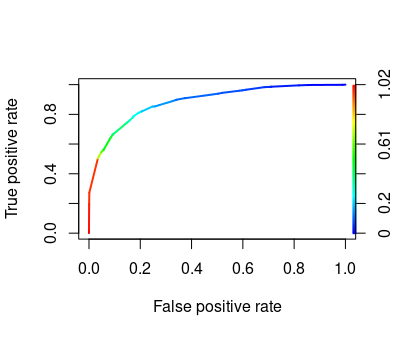

#  Association Rule Classification (arc)

[](http://cran.rstudio.com/web/packages/qCBA/index.html)
[](https://cran.r-project.org/web/packages/arc/index.html)


This package for R implements the Classification based on Associations algorithm (CBA):

 ```Liu, B. Hsu, W. and Ma, Y (1998). Integrating Classification and Association Rule Mining. Proceedings KDD-98, New York, 27-31 August. AAAI. pp 80-86.```

The [arules](https://github.com/mhahsler/arules/) package is used for the rule generation step.

The package is also availabe in **R CRAN repository** as [Association Rule Classification (arc)](https://cran.r-project.org/web/packages/arc/index.html) package.

## Citing this package 
This package for R is described in an [R Journal article](https://journal.r-project.org/archive/2019/RJ-2019-048/index.html)
```
Hahsler, M., Johnson, I., Kliegr, T., & Kuchar, J. (2019). Associative Classification in R: arc, arulesCBA, and rCBA. R Journal, 9(2).
```

## Key features 
- Automatic discretization of predictor attributes
- Automatic tuning of support and confidence thresholds
- Pure R package

## Installation
The package can be installed directly from CRAN using the following command executed from the R environment:
```R
install.packages("arc")
```
Development version can be installed from github from the R environment using the devtools package.
```R
devtools::install_github("kliegr/arc")
```

## Examples

### Use case 1: Building an interpretable classifier
```R
library(arc)
set.seed(101)

# dataset setup

iris_shuffled <- datasets::iris[sample(nrow(datasets::iris)),]
train <- iris_shuffled[1:100,]
test <- iris_shuffled[101:nrow(iris_shuffled),]
classatt <- "Species"

# learn, apply and evaluate the CBA classifier
rm <- cba(train, classatt)
prediction <- predict(rm, test)
acc <- CBARuleModelAccuracy(prediction, test[[classatt]])
print(acc)

# interpret by listing the rules in the classifier
inspect(rm@rules)
```

### Use case 2: Reducing the number of association rules (pruning)
Association rule learning often generates large number of rules.
This shows how to use the arc package to reduce the size of the rule set. 
```R
library(arc)
data(Adult)
classitems <- c("income=small","income=large") #define target attribute (consequent)
rules <- apriori(Adult, parameter = list(supp = 0.05, conf = 0.5, target = "rules"), appearance=list(rhs=classitems, default="lhs"))
# now we have 1266 rules
pruned <- prune(rules,Adult,classitems)
inspect(pruned)
# only 174 after pruning with arc
```

Additional reduction of the size of the rule set can be achieved by setting `greedy_pruning=TRUE`.
```R
pruned <- prune(rules, Adult, classitems, greedy_pruning=TRUE)
inspect(pruned)
# produces 141 rules
```

The resulting rule list can also be used as a classifier.
### Use case 3: Creating a classifier with upper bound on the number of rules in it
In some cases, pruning does not produce sufficiently concise rule list. Function `topRules` allows the user to set the target number of rules that will be used as an input for classifier building, thus serving as the upper bound on rule count.

The [arules documentation](https://cran.r-project.org/web/packages/arules/arules.pdf) gives the following example:
```R
data("Adult")
rules <- topRules(Adult, target_rule_count = 100, init_support = 0.5, init_conf = 0.9, minlen = 1, init_maxlen = 10)
summary(rules)
```
This will return exactly 100 rules. These can then be passed for pruning with CBA:
```R
pruned <- prune(rules, Adult, classitems, greedy_pruning=TRUE)
```
The resulting classifier stored in `pruned` has 33 rules.

### Use case 4: Explaining predictions
First, let's consider a classifier similar to the one learnt in Use case 1, which in `prediction` contains predicted classes for each instance in  `test`:
Consider test instance 1:
``` R
test[1,]
```

```
   Sepal.Length Sepal.Width Petal.Length Petal.Width    Species
51            7.7         3.8          6.7         2.2 virginica
``` 
The prediction is
``` R
prediction[1]
```
```
[1] virginica
Levels: setosa versicolor virginica
```

### Which rule classified a particular instance?
Consider test instance 1:
``` R
firingRuleIDs <- predict(rm, testFold, outputFiringRuleIDs=TRUE) 
inspect(rm@rules[firingRuleIDs[1]])
```

### Obtaining prediction confidence
``` R
confidence_scores <- predict(rm, testFold, outputConfidenceScores=TRUE) 
```
For a particular instance:
``` R
rm@rules[firingRuleIDs[1]]@quality$confidence
rm@rules[firingRuleIDs[1]]@quality$orderedConf
rm@rules[firingRuleIDs[1]]@quality$cumulativeConf
```

Explanation:
* **rule confidence** is computed as  $a/(a+b)$, where $a$ is the number of instances
 matching both the antecedent and consequent (available in slot `support`) and $b$ is the number of instances matching the antecedent but not matching the consequent of the given rule.

The arc package provides two alternative measures:

* **order-sensitive confidence** is computed only from instances reaching the given rule. Note that CBA generates ordered rule lists.
* **cumulative confidence** is an experimental measure computed as the accuracy of the rule list comprising the given rule and all higher priority rules (rules with lower index) with uncovered instances excluded from the computation.

### AUC and ROC curve for binary classification
```R
library(ROCR)
set.seed(101)
classitems <- c("income=small","income=large")
adult <- read.table('https://archive.ics.uci.edu/ml/machine-learning-databases/adult/adult.data', 
                    sep = ',', fill = F, strip.white = T, col.names = c('age', 'workclass', 'fnlwgt', 'educatoin', 
                                                                        'educatoin_num', 'marital_status', 'occupation', 'relationship', 'race', 'sex', 
                                                                        'capital_gain', 'capital_loss', 'hours_per_week', 'native_country', 'income'))
split = sample(c(TRUE, FALSE), nrow(adult), replace=TRUE, prob=c(0.75, 0.25))

trainFold <- adult[split,]
testFold <- adult[!split,]

classAtt <- "income"
positiveClass<-">50K"
rm <- cba(trainFold, classAtt, list(target_rule_count = 1000))
confidence_scores <- predict(rm, testFold, outputConfidenceScores=TRUE,positiveClass=positiveClass)

pred_cba <- ROCR::prediction(confidence_scores, factor(testFold[[classAtt]]))
roc_cba <- ROCR::performance(pred_cba, "tpr", "fpr")
ROCR::plot(roc_cba, lwd=2, colorize=TRUE)
lines(x=c(0, 1), y=c(0, 1), col="black", lwd=1)
auc <- ROCR::performance(pred_cba, "auc")
auc <- unlist(auc@y.values)
auc
```


```
> auc
[1] 0.8946532
```

### Performance tweaks
#### Rule learning
* When invoking `topRules`, set `init_maxlen` parameter to a low value:
```R
data("Adult")
classitems <- c("income=small","income=large")
rules <- topRules(Adult, target_rule_count = 100, init_support = 0.05, init_conf = 0.5, minlen = 1, init_maxlen = 2, appearance=list(rhs=classitems, default="lhs"))
inspect(rules)
```
#### Rule pruning
* Experiment with the value of the `rule_window` parameter. This has no effect on the quality of the classifier. 
* Set `greedy_pruning` to TRUE. This will have generally slightly adverse impact on the quality of the classifier, but it will decrease the size of the rule set and reduce the time required for pruning. Greedy pruning is not part of the CBA algorithm as published by Liu et al. 

